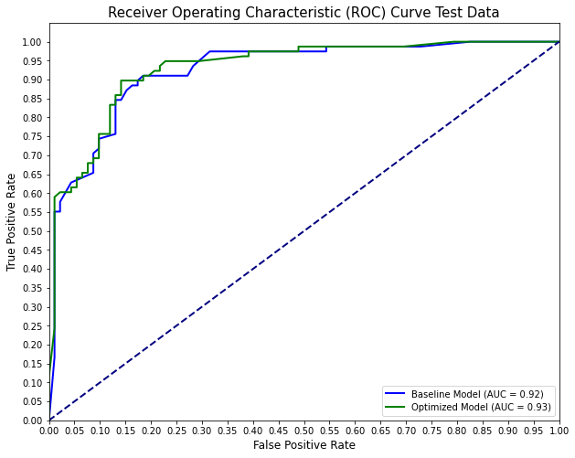
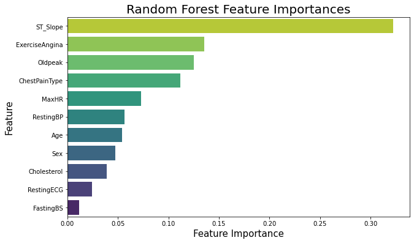
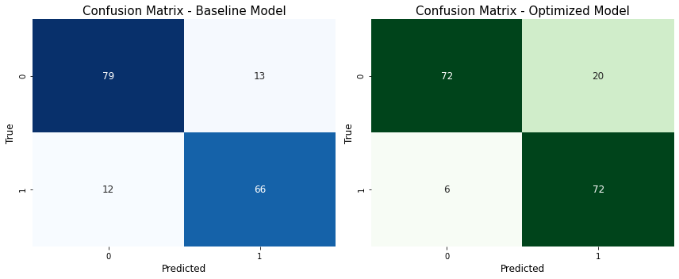

# Heart Disease Prediction
**Author:** Cristopher Delgado 
**Date:** September 2023

## Overview
This project was completed as part of the Flatiron School Curriculum for Data Science Phase 3 Machine Learning Fundamentals.

Cardiovascular diseases (CVDs) is the leading cause of death globally. In 2019 about 18 million people died from CVDs which represents 32% of all global deaths. Out of this 32% of deaths 85% were the result of a heart attack and stroke. Most CVDs can be prevented with proper behavioral risk mitigation however, a person can not simply tell someone and control their behavioral tasks related to CVD such as unhealthy diet, physical inactivity, etc. Overall, the importance of detecting CVDs as early as possible is essential to properly start counseling and treatment of patients.

## Buisness Understanding
The main goal of this project is to address the idea of diagnostics in Cardiovascular Diseases. Where the stakeholder can be Diagnostic based Medical Device company that wants to integrate machine learning to provide continous monitoring and early deetction of Cardio Vascular Disease related symptoms into developing medical devices or already existent devices. 

## Buisness Problem 
**Stakehokder:** Diagnostic Medical Device Company

The stakeholder wants to determine what related features to CVDs are the most important to monitor. Knowing that information they would like to develop medical devices for either at home use for patients or clinical use devices and potentially use Machine Learning algorithims incorporated into there diagnostic devices and create software as a medical device.

## Data Understanding:

This project utilizes a dataset from Kaggle titled [Heart Failure Prediction Dataset](https://www.kaggle.com/datasets/fedesoriano/heart-failure-prediction). This dataset was created by combining different datasets already available independently but not combined before. In this dataset, 5 heart datasets are combined over 11 common features. Every dataset used can be found under the Index of heart disease datasets from UCI Machine Learning Repository

* [Cleveland](https://archive.ics.uci.edu/dataset/45/heart+disease): 303 observations
* [Hungarian](https://archive.ics.uci.edu/dataset/45/heart+disease): 294 observations
* [Switzerland](https://archive.ics.uci.edu/dataset/45/heart+disease): 123 observations
* [Long Beach VA](https://archive.ics.uci.edu/dataset/45/heart+disease): 200 observations
* [Stalog (Heart) Data Set](https://archive.ics.uci.edu/dataset/145/statlog+heart): 270 observations

The features in this dataset are the following:

* Age: age of the patient [years]
* Sex: sex of the patient [M: Male, F: Female]
* ChestPainType: chest pain type [TA: Typical Angina, ATA: Atypical Angina, NAP: Non-Anginal Pain, ASY: Asymptomatic]
* RestingBP: resting blood pressure [mm Hg]
* Cholesterol: serum cholesterol [mm/dl]
* FastingBS: fasting blood sugar [1: if FastingBS > 120 mg/dl, 0: otherwise]
* RestingECG: resting electrocardiogram results [Normal: Normal, ST: having ST-T wave abnormality (T wave inversions and/or ST elevation or depression of > 0.05 mV), LVH: showing probable or definite left ventricular hypertrophy by Estes' criteria]
* MaxHR: maximum heart rate achieved [Numeric value between 60 and 202]
* ExerciseAngina: exercise-induced angina [Y: Yes, N: No]
* Oldpeak: oldpeak = ST [Numeric value measured in depression]
* ST_Slope: the slope of the peak exercise ST segment [Up: upsloping, Flat: flat, Down: downsloping]
* HeartDisease: output class [1: heart disease, 0: Normal]

## Data Exploration
### Methodology

1. Perform data cleaning which consists of casting columns to correct data types, dealing with missing values accordingly. 
2. Perform data exploration and view correlations
3. Normalize continuous data in order to have all the data on the same scale.
4. Create Testing and Training sets to train classification models and validate there performances.
5. Observe important features from top performing model.

### Basline vs Optimized Model
To view all the models from baseline and their optimized version please view the notebook. The best performing model was the Random Forest model. This model has a strong discrimation as its Area Under the Receiver Operating Characteristic curve was the highest and showed no overfit. The optmized model slightly increased the Area under the Receiver Operating Characteristic curve but it was not by much. The main differences we can see is how the model has more discrimination ability compared to is baseline version as we can see from the Receiver Operating Characteristic curve.

The model determined that the top 3 important features in its deciding algorithim were:

1. ST_Slope: the slope of the peak exercise ST segment
2. Excercise Angina: exercise-induced angina
3. OldPeak: ST [Numeric value measured in depression]

Lastly, the optimized model was trained to obtain the best recall score because I wanted the model's ability to correctly identify positive instances and minimize false negatives. The reasoning for that was again the worst case scenario for this model. It would be worse to miss someone with heart disease when in reality they did have heart disease. In summary, I wanted the model to capture all positive cases and minimize false negatives. We see that that is the case. The baseline model has less positive instances (TP=79 and FP=13) in comparison to the our optimized model which has more positive instances (TP=72 and FP=20). The baseline FN = 12 while the optmized model FN = 6. That being said the model optimized in the way I intended it to.

## Evaluation:

I recommend to incorporate the Random Forest model into diagnostic medical device software for the purposes of monitoring Cardio vascular realetd symptoms for Cardio Vascular Diseases. 